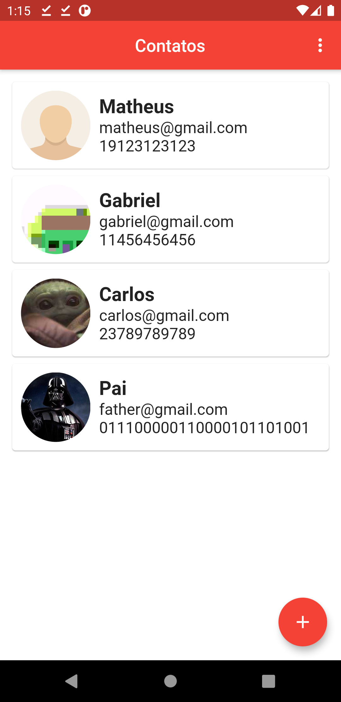
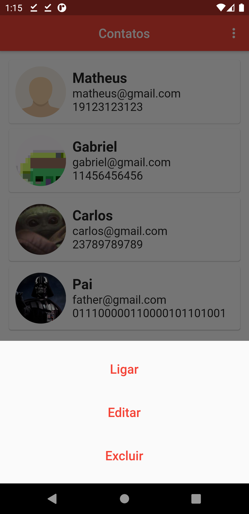
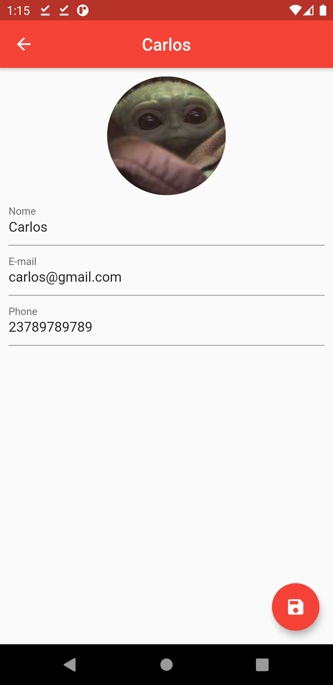
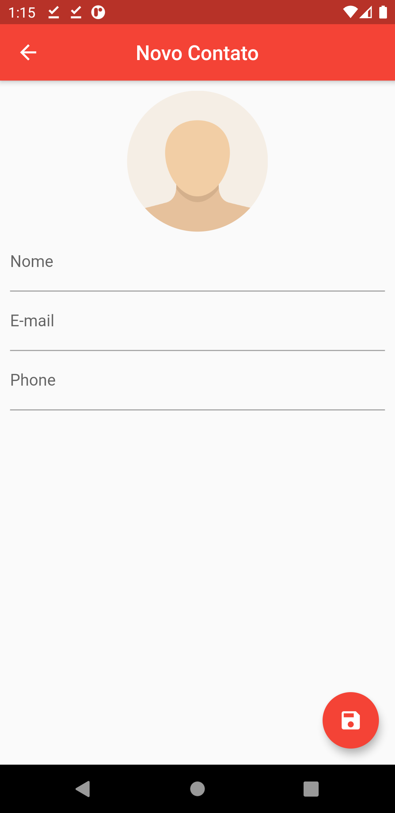

# Agenda de contatos

Projeto feito em Flutter.

<h3>Descrição do aplicativo:</h3>
Aplicativo hibrido que permite cadastrar, editar, ordena e excluir contatos.

<table style="width:100%;">
  <tr>
    <td></td>
    <td></td>
    <td></td>
    <td></td>
  </tr>
</table>
